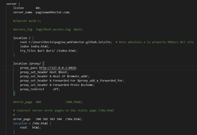

# Docker y Nginx como balanceador de carga

1.	Intalamos docker (https://docs.docker.com/desktop/install/windows-install/)

3.	Vamos a crear una carpeta vacia y la llamamos como queramos, en mi caso, **Balanceador_Carga**

4.	Abrimos la Windows PowerShell para comenzar con los comandos, y uan vez estemos donde nuestra carpeta vamos a crear tres htmls:
 -  PS C:\Users\hecto\Balanceo_Carga> echo "Hola Server 1"> como h1 index.1.html
 -  PS C:\Users\hecto\Balanceo_Carga> echo "Hola Server 2"> como h1 index.2.html
 -  PS C:\Users\hecto\Balanceo_Carga> echo "Hola Server 3"> como h1 index.3.html

4.	Con esto podemos levantar contenedores de docker para cada html que hemos creado anteriormente, **pero en terminales separadas**:
     * docker run --rm -v C:\Users\hecto\Balanceo_Carga\index.1.html:/usr/share/nginx/html/index.html   -p 8080: 80 nginx
     * docker run --rm -v C:\Users\hecto\Balanceo_Carga\index.2.html:/usr/share/nginx/html/index.html  -p 8081: 80 nginx
     * docker run --rm -v C:\Users\hecto\Balanceo_Carga\index.3.html:/usr/share/nginx/html/index.html  -p 8082: 80 nginx

5. En la carpeta de hosts de Windows incorporamos las direcciones para los servidores 1, 2 y 3

6.	Para extraer las direcciones IP o IPAdress, existen dos formas de acceder a estos valores:
o	Una primera por medio de la terminal con el comando **docker inspect (nombre del contenedor)**. Ej: docker inspect clever_williams.

 - Accediendo dentro de Docker Desktop a nuestro contenedor, dentro de el seleccionamos la pestaña de Inspect y la opción de Networks donde encontraremos el campo de IPAdress

 
7.	Incoporamos los valores de IP a hosts
  

10.	Tras ello debemos crear un archivo **default.conf** :

11.	Ejecutamos en una nueva terminal el comando: **docker run --rm -v C:\Users\hecto\Balanceo_Carga\default.conf:/etc/nginx/conf.d/default.conf -p 8085:80 nginx** para levantar el config anterior en el puerto 8085.

12.	Y por ultimo para ver si funciona accedemos por medio de un buscador a http://localhost:8085
Para que solo nos devuelva un servidor en concreto se usa **ip hash**.

Para poner uno como backup se monta como server server1.com:80 **backup**;
Para deshabilitar un servidor se hace con server server2.com:80 **down**;

Para que cada servidor tenga a su vez los tres servidores creados

--- 

# Crear una imagen con mkdocs y nginx, encapsulado en docker.

Entre los elementos que ya hemos creado anteriormente, en este proyecto vamos a utilizar:
-	La página creada en Mkdocs (HTML, CSS, JS, images, …) que se creó con el comando de **gh-deploy**
-	El reverse Proxy que creamos con Nginx en su archivo nginx.conf y en hosts
1.	Vamos a crear un archivo de **Dockerfile** en la ruta donde tenemos nuestra página web, en la ruta **C:\Users\hecto\pagina_web\Hector.github.io**
**(En este caso vamos a correrlo en el puerto 8018)**

 
2.	Revisamos que el **mkdocs.yml** este correctamente diseñado

3.	Una vez hayamos creado el archivo, accedemos a su ubicación por medio de Windows Powershell en Administrador dentro de site, siendo la ruta **C:\Users\hecto\pagina_web\Hector.github.io**
4.	Es importante que tengamos habilitado el Docker Desktop para poder ejecutar los siguientes comandos y evitar el error del cliente de docker
5.	Ejecutamos el comando **docker build -t mkdocs-nginx-docker-paginawebhector .** para crear la imagen de Docker.

6.	Tras ello deberíamos ejecutar el contendor de docker basado en esa imagen con el siguiente comando **docker run -d -p 8018:8018 mkdocs-nginx-docker-paginawebhector**

7.	Y por último accedemos usando **http://localhost:8018** a nuestra imagen de página web

8.	Incorporar un Proxy Inverso con Nginx

9.	Necesitamos abrir una nueva Windows PowerShell, accediendo a donde tengamos Nginx y en concreto al archivo de nginx.conf, en mi caso en la dirección con el comando **cd C:\Users\hecto\Downloads\nginx-1.24.0\conf**
10.	Ejecutamos el comando para activar nginx, **start ./nginx**
11.	Actualizamos cualquier cambio que realizamos **./nginx -s reload**
12.	Si introducimos en el buscador http://paginawebhector.com/ obtenemos la página web

---

# Crear una imagen con mkdocs y nginx, encapsulado en docker. **(DESDE CERO)**

1.	Abrimos un Windows PowerShell en administrador
2.	Creamos una nueva carpeta **mkdir mkdocs_docker_project**
3.	Clonamos nuestro repositorio local con el comando **git clone --recurse-submodules** **https://github.com/HectorCRZBQ/webpage.git**

4.	Accedemos a esa carpeta para clonar nuestra página web **cd C:\Users\hecto\mkdocs_docker_project\webpage**
5.	Vamos a crear un archivo de **Dockerfile**

6.	Es importante que tengamos habilitado el Docker Desktop para poder ejecutar los siguientes comandos y evitar el error del cliente de docker
7.	Ejecutamos el comando **docker build -t mkdocs-nginx-docker-paginawebhector .** para crear la imagen de Docker.

8.	Tras ello deberíamos ejecutar el contendor de docker basado en esa imagen con el siguiente comando **docker run -d -p 8000:8000 mkdocs-nginx-docker-paginawebhector**
9.	Y por último accedemos usando **http://localhost:8000** a nuestra imagen de pagina web

---

Hector de la Cruz Baquero - [Linkdedin](https://www.linkedin.com/in/h%C3%A9ctor-de-la-cruz-baquero-ba193429b/) - [Webpage](https://hectorcrzbq.github.io/)

